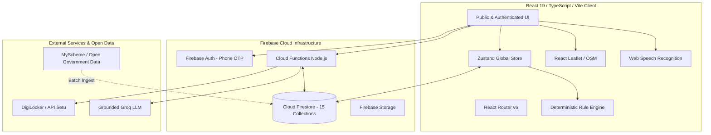

# Architecture Spine: SchemeSathi

## 1. Executive Summary & Design Paradigm

SchemeSathi is engineered as a **Deterministic Rule Engine + Hybrid Context-Injected Assistant + Offline-Resilient React SPA**. 

The core architecture strictly separates **transparent, mathematical eligibility evaluation** from **conversational interface layers**. The recommendation and financial calculations never rely on nondeterministic LLM reasoning; instead, pure TypeScript rule engines execute locally within `< 50ms`, while a serverless Firebase backend and cloud AI side-drawer provide context-grounded conversational explanations, geo-spatial partner routing, and document synchronization.



---

## 2. Invariants & Architectural Decisions (ADs)

### AD-1 [Cloud Firestore 15-Collection Partitioning]
- **Status:** [ADOPTED]
- **Binds:** All backend data persistence and entity storage.
- **Prevents:** Monolithic document bloat, unauthorized cross-tenant data leaks, and schema fragmentation.
- **Rule:** Data must be normalized across 15 typed Firestore collections: `users`, `schemes`, `schemeRules`, `partners`, `partnerSchemes`, `recommendations`, `assessments`, `savedSchemes`, `savedPartners`, `calculatorHistory`, `documents`, `applicationJourneys`, `categories`, `translations`, `adminUsers`. All user-specific collections must enforce strict Firestore Security Rules (`request.auth.uid == resource.data.userId`).

### AD-2 [Zero-API Dependency Geo-Spatial Mapping]
- **Status:** [ADOPTED]
- **Binds:** Channel Partner locator, spatial search, and distance routing on `/partners`.
- **Prevents:** Google Maps billing traps, quota exhaustion, and API-key exposure.
- **Rule:** Mapping is standardized exclusively on `react-leaflet` with OpenStreetMap tile servers (`tile.openstreetmap.org`). Distance calculation must be computed client-side using the Great-Circle Haversine formula over partner latitude/longitude coordinates. If geolocation fails or is denied, the system must fall back to State and District dropdown filtering.

### AD-3 [Pure Deterministic Eligibility & 100-Point Scoring Engine]
- **Status:** [ADOPTED]
- **Binds:** Scheme matching, ranking, and explainability calculations (`src/services/recommendation/`).
- **Prevents:** Nondeterministic LLM hallucinations, slow API latency during matching, and opaque recommendation black-boxes.
- **Rule:** The scheme recommendation engine must be implemented as pure, deterministic TypeScript functions. Suitability is computed using an exact 100-point formula:
  $$	ext{Score} = 	ext{Income (20)} + 	ext{Category (20)} + 	ext{Purpose (20)} + 	ext{Loan Amount (20)} + 	ext{Age (10)} + 	ext{Location (10)}$$
  All scores must be displayed with the label *"Indicative matching score"* and provide structured positive reasons ("Why You Match") and negative reasons ("Why Not This Scheme?") with alternative links.

### AD-4 [Grounded Conversational AI & Web Speech Pipeline]
- **Status:** [ADOPTED]
- **Binds:** Voice input modal, persistent chat drawer, and AI assistance.
- **Prevents:** Fabricated loan approvals, hallucinated government policies, and browser speech lockups.
- **Rule:** Voice input must use the browser-native Web Speech API with fallback to text chat. The conversational AI (Groq / Gemini via Cloud Functions) must receive retrieved Firestore scheme context in its system prompt and adhere strictly to the AI Safety Rule: if information cannot be verified against official scheme records, it must return *"I couldn't verify this information from the available official source."*

### AD-5 [DigiLocker Integration with Resilient Manual Upload Fallback]
- **Status:** [ADOPTED]
- **Binds:** Document readiness and certificate verification.
- **Prevents:** Workflow stoppage when DigiLocker APIs are offline or unconfigured.
- **Rule:** DigiLocker integration operates strictly on a consent-based metadata exchange via Cloud Functions. The client UI must always provide an instant, seamless *"Upload manually"* option so that document checklist readiness (e.g., "3/5 documents ready") can proceed without blocking the user.

### AD-6 [Reactive State Management & 3-Language Localization]
- **Status:** [ADOPTED]
- **Binds:** Frontend application state and UI translation.
- **Prevents:** Prop drilling, state desynchronization across routes, and untranslated interface strings.
- **Rule:** Global state (user profile, assessment form inputs, comparison cart, active journey milestones, and language preferences) is managed via Zustand stores (`src/stores/`). Localization is managed through `react-i18next` with complete translation keys maintained in `src/locales/en.json`, `hi.json`, and `mr.json`.

### AD-7 [Strict Minimal PII & Data Privacy Policy]
- **Status:** [ADOPTED]
- **Binds:** All data models, storage schemas, and network payloads.
- **Prevents:** Privacy violations, Aadhaar Act non-compliance, and security breaches.
- **Rule:** SchemeSathi shall never collect, transmit, or store raw Aadhaar numbers, biometric data, bank account credentials, or user passwords. Unauthenticated assessment runs process in session memory only; persistent records are saved only upon explicit user authentication.

---

## 3. Data Architecture & Firestore Schema Blueprint

```
Firestore Database
├── /users/{userId}
│   ├── uid, preferredLanguage, state, district, profilePreferences, createdAt
├── /schemes/{schemeId}
│   ├── name, slug, description, ministry, category, purpose, targetBeneficiaries
│   ├── minIncome, maxIncome, minAge, maxAge, minLoanAmount, maxLoanAmount
│   ├── interestRate, moratoriumMonths, repaymentMonths, eligibilityRules
│   ├── requiredDocuments, channelPartnerTypes, officialSource, isVerified
├── /partners/{partnerId}
│   ├── name, type (SCA|PSB|RRB|NBFC_MFI), address, state, district, geo {lat, lng}
│   ├── phone, email, supportedSchemes, supportedCategories, status, availability
├── /assessments/{assessmentId}
│   ├── userId, inputs, topMatches, createdAt
├── /applicationJourneys/{journeyId}
│   ├── userId, schemeId, partnerId, currentStage (1..8), stageHistory, updatedAt
└── /adminUsers/{adminId}
    ├── email, role, permissions, lastLogin
```

---

## 4. Operational & Environmental Envelope

| Dimension | Specification |
| :--- | :--- |
| **Frontend Runtime** | React 19, TypeScript 5.8+, Vite 8, Tailwind CSS v4 |
| **Process Management** | PM2 running Vite dev server on `0.0.0.0:3002` (dev default) |
| **Backend & Cloud** | Firebase Cloud Functions (Node.js 20), Cloud Firestore, Firebase Auth |
| **Performance SLA** | Matching engine latency $< 50\text{ms}$; Full journey discovery $< 30\text{s}$ |
| **Scalability Target** | 1,000 concurrent active demo users supported on baseline tier |
| **Browser Compatibility** | Chrome, Edge, Safari, Firefox, Mobile WebViews (iOS & Android) |

---

## 5. Deferred Decisions (Non-Invariants)
- **Advanced Predictive ML Routing:** Upgrading rule-based scoring to hybrid neural embeddings deferred to post-MVP v2.2.
- **Direct WhatsApp / IVR Webhooks:** Multi-channel conversational endpoints deferred to Phase 3.
- **Real-time Live NPA Sync:** Automated banking core connectors deferred until official public API gateways are provisioned by authorities.

---

## 6. PRD Requirement Traceability Matrix

| Architectural Decision | PRD Requirements Covered |
| :--- | :--- |
| **AD-1 (Firestore Collections)** | FR-18 (Dashboard), FR-5 (Scheme Details), NFR-S2 (Security) |
| **AD-2 (Leaflet & OSM)** | FR-10 (Partner Locator), FR-11 (Partner Routing), FR-12 (Demo Data) |
| **AD-3 (100-pt Rule Engine)** | FR-1 (Intake), FR-2 (Scoring), FR-3 (Indicative Labels), FR-6 (Compare) |
| **AD-4 (Voice & Grounded AI)** | FR-13 (Multilingual Voice), FR-14 (AI Safety Grounding) |
| **AD-5 (DigiLocker & Fallback)**| FR-15 (Checklist), FR-16 (DigiLocker Sync & Upload Fallback) |
| **AD-6 (Zustand & i18n)** | FR-4 (Explorer), FR-7/8/9 (Calculators), NFR-A1 (English/Hindi/Marathi) |
| **AD-7 (Minimal PII Policy)** | NFR-S1 (Minimal PII), NFR-S3 (HTTPS & Secret Hygiene) |
