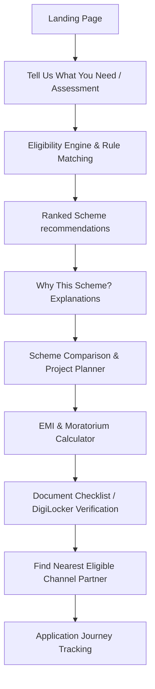

# Scheme Sathi — Structured PRD Digest
**Version:** 2.0 (Expanded SIH MVP)  
**Source File:** `raw_extracted_prd.txt`  
**Date of Extraction:** August 27, 2026

---

## 1. Core Vision, Problem Statements, and Target Audience

### Product Vision & Positioning
* **Vision:** Build a single digital companion that guides an eligible beneficiary from "I need financial assistance" to "I know which scheme suits me, how much assistance I may receive, what repayment could look like, what documents I need, and which authorized Channel Partner I should approach."
* **Tagline:** *"Find the Right Scheme. Find the Right Support."*
* **Core Principle:** *"Don't just tell the citizen which schemes exist. Tell them which scheme may fit their situation, why it fits, what it could mean financially, what they need, and where they should go next."*
* **Positioning:** Scheme Sathi is a decision-support and navigation layer for government financial-assistance schemes, specifically differentiated by intelligent financial-assistance matching, financial planning, and Channel Partner discovery/routing. It is *not* a resume builder (no templates, resume scoring, or recruiter functions), a generic chatbot, or a simple scheme directory.

### Problem Statements & Key Gaps Addressed
1. **Discoverability (Gap 1):** Beneficiaries do not know which scheme matches their specific circumstances.
2. **Eligibility Understanding (Gap 2):** Confusion around complex eligibility criteria involving income, age, occupation, caste category, state, project purpose, education, and disability.
3. **Financial Understanding (Gap 3):** Lack of clarity around loan amounts, interest rates, EMI, moratorium periods, repayment periods, and own contribution requirements.
4. **Channel Partner Connectivity & Routing (Gaps 4 & 5):** Beneficiaries may discover a scheme but do not know which authorized Channel Partner can process it, or where they are located. Simple routing to the nearest bank is insufficient; routing must target eligible and geographically appropriate partners.
5. **Document Readiness (Gap 6):** Beneficiaries frequently approach agencies without knowing or having the required documentation.
6. **Application Journey Guidance (Gap 7):** Lack of end-to-end guidance after scheme discovery, leaving users stranded at external links.
7. **Language & Accessibility (Gap 8):** Information is often unavailable in regional languages or formats accessible to low-literacy users.

### Target Audience
* **Primary Users:** Scheduled Caste (SC) beneficiaries seeking business/livelihood assistance, education loans, agricultural support, transport loans, or manufacturing/service-business support.
* **Secondary Users:** Common Service Center (CSC) operators, NGO workers, family members, community facilitators, and financial-literacy volunteers.

---

## 2. Key Features and Functional Requirements

### P0 (Must Have)
* **Smart Scheme Recommender:** A 6-8 question questionnaire assessing personal details (State, District, Age, Gender, SC status), occupation, education, and financial requirements. Works via a traditional form or voice/conversational input.
* **Eligibility Engine & Explainable Matching:** A rule-based engine filtering schemes and generating an indicative "Match Score" (e.g., "92% Strong Match") along with reasons for matching or exclusion (e.g., *"Your income falls within the listed range."* or *"Your requested loan amount exceeds the listed maximum."*).
* **Scheme Explorer & Details:** A searchable list with filters (category, state, income, amount, purpose) and detailed pages covering eligibility, loan limits, interest, moratorium, repayment, required docs, and official source attribution.
* **EMI & Moratorium Calculator:** A calculator using the standard formula to show EMI, total principal, interest, and repayment. Can be automatically pre-loaded from scheme details with moratorium adjustments.
* **Channel Partner Locator & Filtering:** Geo-spatial partner discovery mapping State Channelizing Agencies, Public Sector Banks, Regional Rural Banks, and NBFCs using React Leaflet & OpenStreetMap.
* **Document Checklist:** Visual verification list tracking document readiness.
* **Multilingual Interface:** Full localization support using translation files for English, Hindi, and Marathi.
* **Firebase Core Backend:** Integrating Firebase Authentication, Firestore database, and Hosting.

### P1 (High Value)
* **AI Scheme Assistant:** Context-aware assistant utilizing verified scheme data to extract profiles and recommend schemes.
* **Voice Chat / Voice Input:** Voice-based conversational assessment in English, Hindi, Hinglish, and Marathi.
* **Scheme Comparison:** Side-by-side comparison of multiple schemes across purpose, eligibility, limits, interest, moratorium, and own contribution.
* **Project Cost Planner:** Tool for building a custom project budget (equipment, raw materials, rent, working capital) to feed into the recommendation engine.
* **Loan Financing Breakdown:** Visual breakdown of total project cost, potential scheme finance, and own contribution.
* **Application Journey Guidance:** Self-managed tracking timeline from "Scheme Identified" through "Application Started" to "Decision".
* **Saved Schemes & Partners:** Storage of favorite schemes, partners, and calculations in the user dashboard.

### P2 & P3 (Advanced & Future)
* **DigiLocker Integration (P2/P1):** Official retrieval of Aadhaar, caste, education, and income certificates.
* **Admin Portal (P2):** Management interface to add/edit/verify schemes and partners, track data verification status, and view platform analytics.
* **Future Channels (P3):** WhatsApp integration, Interactive Voice Response (IVR), CSC integrations, and real-time partner fund utilization tracking.

---

## 3. User Journeys and Workflows

### Core Platform Journey

### SIH Demonstration Flow (14 Steps)
1. **Landing Page:** User clicks **Find My Scheme**.
2. **Intent Selection:** User chooses **Start a Business**.
3. **Assessment:** User inputs details: State, Income, Category (SC), Project Cost, Age.
4. **Matching:** Scheme Sathi generates 3 potential matches with scores (e.g., Scheme A: 92%, Scheme B: 84%).
5. **Details:** User opens Scheme A to view eligibility, financing limits, and required documents.
6. **Financials:** User clicks **Calculate My EMI**.
7. **Repayment:** UI displays calculated EMI, total interest, and repayment timeline.
8. **Support:** User clicks **Find My Channel Partner**.
9. **Mapping:** Interactive Map displays nearest eligible partners, distance, and partner type.
10. **Partner Selection:** User selects the nearest partner.
11. **Checklist:** User views the required Document Checklist.
12. **DigiLocker:** User retrieves official certificates via DigiLocker.
13. **Fallback:** User views manual document upload fallback if needed.
14. **Voice Assistant:** User triggers **Talk to Scheme Sathi** to run a conversational query.

---

## 4. Technical, Performance, and Privacy Constraints

### Technical Stack & Constraints
* **Frontend:** React, Vite, TypeScript, Tailwind CSS.
* **Backend:** Firebase (Auth, Firestore, Hosting, Cloud Functions).
* **Mapping:** Leaflet & OpenStreetMap (no Google Maps API dependency for the MVP).
* **Low-Bandwidth Optimization:** Mobile-first design, lazy-loaded maps, asset compression, text-first layout, and static data caching to ensure usability for users with limited connectivity.

### Performance Requirements
* **Recommendation Response:** `< 3 seconds` for local/rule-based matching.
* **End-to-End Journey:** `< 30 seconds` for assessment-to-result completion.
* **Concurrency:** Support approximately `1,000 concurrent demo users` for the SIH presentation.

### Privacy & Data Security Constraints
* **PII Minimization:** No storage of personal identifiable information (PII) or session-based processing for MVP scheme recommendations.
* **Restricted Fields:** Never collect or store unnecessary Aadhaar numbers, passwords, unnecessary financial details, or personal files.
* **DigiLocker Security:** Use official APIs. Do not ask for or store DigiLocker credentials, bypass user consent, or scrape content.
* **Firestore Security:** Implement strict Firestore Security Rules and role-based administration.
* **API Secrets:** Ensure no secrets or API keys are committed to Git (strict `.env` enforcement).

### Data Integrity & Disclaimers
* **Hallucination Prevention:** The AI assistant must never invent scheme benefits, interest rates, eligibility, or partner/fund availability.
* **Synthetic Data Policy:** Real-time channel partner funds or NPA data should only use synthetic/mock values if clearly labeled as **"Demo data"** with a visible last-updated timestamp.
* **Official Disclaimer:** The platform must display an official disclaimer stating: *"Scheme recommendations are indicative and do not constitute official eligibility or approval."*
